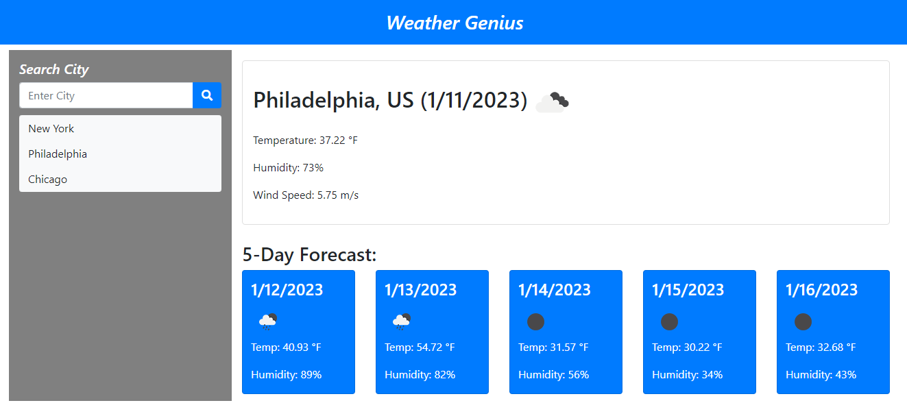

# Weather-Genius

## Description
Checking the weather is something everyone does often. With the Weather Genius you can quickly get the current weather and the 5-day forecast for any city you want. You will receive the temperature, humidity and wind speed so you can plan accordingly. This app uses a server-side API to make the call and return the weather. Your previous seaches are stored in local storage to easily jump back to past searches. Icon have been added for quick weather recognition. Enjoy!



# Links
```
Visit the completed Weather-Genius: https://mikestem.github.io/Weather-Genius/
Visit the github repository at: https://github.com/mikestem/Weather-Genius